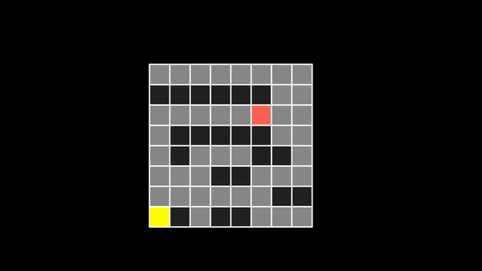
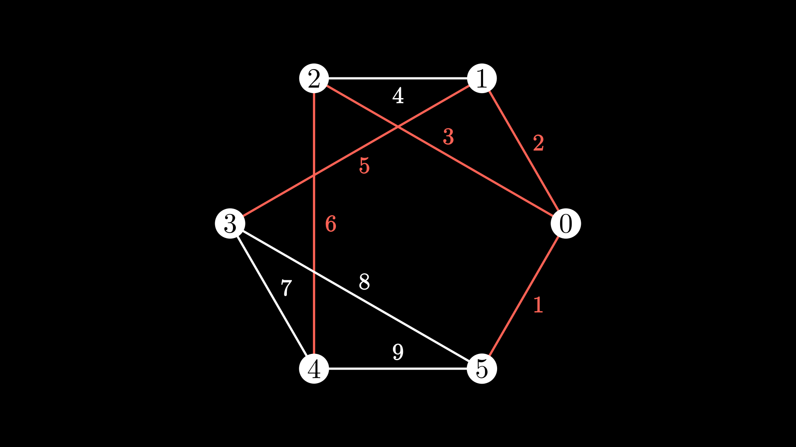

# Data Structures
## Pre-req
- manim installed
- python 3.7

## 00. Ghost
You can ignore this code. This code is to apeear active in Microsoft Teams. Nothing special.

## 01. Dijkstra Path Finding Animation
### **Input**
A ```.txt``` file that defines: 
- $N \times M$ board with walls
- source cell
- target cell. 

The format must include:
- ```W``` for Wall cell
- ```S``` for Source cell
- ```A``` for Available cell
- ```D``` for Destionation cell

**Example**
```txt
A A A A A A A A
W W W W W W A A
A A A A A D A A
A W W W W W A A
A W A A A W W A
A A A W W A A A
A A A A A A W W
S W A W W A A A
```

The code doesn't provide any checks for conectivity or bad input format, so please be sure that you provide a valid input. 

### **Output**
A ```.mp4``` file that shows how Dijkstra's algorithm finds the minimal route from source cell to destination cell without passing through any wall and assuming that all available cells surrounding a given available cells (8 at most) are connected, and going through one of the them costs the same. Some temporal files are created during the animation make. 

**Example**



### **How to run**
Run in the ```01_dijkstra``` folder project folder:
```sh
py -3.7 dijkstra.py
```

## 02. Kruskal MST from Graph
### **Input**
A ```.txt``` file that defines: 
- $N \times N$ adjacency matrix of a Graph with $N$ vertices.
- Each entry represents the weight of the bound

**Example**
```txt
0 2 3 0 0 1
2 0 4 5 0 0
3 4 0 0 6 0
0 5 0 0 7 8
0 0 6 7 0 9
1 0 0 8 9 0
```

The code doesn't provide any checks for conectivity or bad input format. The code assumes square symmetric matrix, and it will only check the top right triangular matrix. 

### **Output**
A ```.png``` file that shows MST from the given graph. The image shows the MST highlighted on top of the graph. It shows the weight of each edge.

**Example**



### **How to run**
Run in the ```02_kruskal``` folder project folder:
```sh
py -3.7 kruskal.py
```

## 03. Arithmetic Parser
### **Input**
Console input of a string that represents a mathematical (arithemtic) expression to be evaluated.

**Example**
```log
100 * ( 2 + (3*(2+4/2)) ) / 14
```

The code doesn't provide any checks for bad synatxis input, so please ensure that the input string is mathematically valid. 

### **Output**
Console output of the evaluated expression

**Example**

```sh
# Running script
PS C:\Users\dalopezt\manim\03_parser> .\run.ps1

# Console input
Type message: 100 * ( 2 + (3*(2+4/2)) ) / 14

# Console output
Result: 100
```

### **How to run**
Run in the ```03_parser``` folder project folder:
```sh
./run.ps1
```

## 04. AVL Tree
### **Input**
Console input of the number of nodes to be inserted, followed by the list of all the values

**Example**
```sh
5 # Number of nodes
1 # Node 1
2 # Node 2
3 # Node 3
4 # Node 4
5 # Node 5
```

The code doesn't provide any checks for bad inputs. Please use positive int values for all the inputs.

### **Output**
Console output of inorder traversal with node and height values (from leaves to root).

**Example**

```sh
# Running script
PS C:\Users\dalopezt\manim\04_avl> .\run.ps1

# Console input
Number of nodes: 5
Value of 1 node: 1
Value of 2 node: 2
Value of 3 node: 3
Value of 4 node: 4
Value of 5 node: 5

# Console output
{v: 1, h: 1}
{v: 2, h: 3}
{v: 3, h: 1}
{v: 4, h: 2}
{v: 5, h: 1}
```

### **How to run**
Run in the ```04_avl``` folder project folder:
```sh
./run.ps1
```